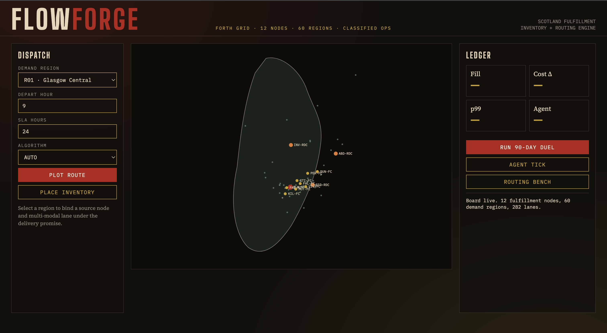
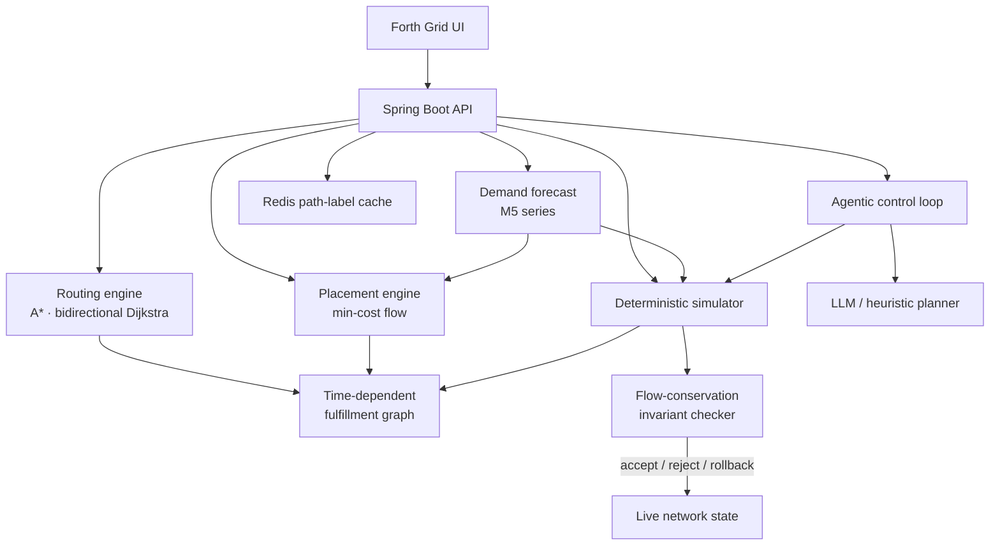

# FlowForge

FlowForge is a multi-echelon inventory placement and fulfillment routing engine. It places stock across a 12-node Scottish fulfillment network, then routes each order from a source node over multi-modal lanes so the delivery-promise SLA still holds.

Placement is a min-cost flow on a demand-forecast-weighted graph. Routing is a constrained shortest path — A* or bidirectional Dijkstra — with time-dependent edge costs. An agentic control loop proposes safety-stock, lane-capacity, and node-to-region changes; a deterministic simulator with a flow-conservation checker accepts, rejects, or rolls each change back.

The live board is a Java / Spring Boot API with a Forth Grid control UI. Path labels can be precomputed in Redis. The stack deploys as Docker on AWS ECS.

## Forth Grid



Dispatch picks a demand region, SLA, and algorithm. The plate shows the 12-node / 60-region Scottish network. The ledger reports on-hand stock, the M5 forecast, and placement or simulation results.

## What it does

- Places inventory across **12 fulfillment nodes** serving **60 demand regions**
- Solves placement as **min-cost flow** (successive shortest path with reduced-cost potentials)
- Routes each order with **A\*** or **bidirectional Dijkstra** on time-dependent, multi-modal lanes (road, rail, air, ferry, last mile)
- Binds a **source node + lane set** to a delivery-promise SLA
- Forecasts demand from **M5-schema retail series** (seasonal-naive and Croston)
- Runs a **deterministic simulator** that compares FlowForge against a nearest-node greedy policy and checks flow conservation at every node and period
- Lets an **LLM or heuristic planner** propose network edits, then verifies them in the simulator before they land

## Architecture



**Request path.** A route call expands the live network into a time-dependent graph, scores candidate source nodes that have stock, and returns the SLA-feasible path with the lowest cost. A placement call builds a transportation problem — supply at nodes, forecast demand at regions, holding plus routing cost on each arc — and ships a min-cost flow. An agent tick proposes deltas, clones the network, resimulates, and only commits if conservation holds and service does not collapse.

## Run

```bash
./mvnw test
./mvnw spring-boot:run
```

Open [http://localhost:8080](http://localhost:8080) for the Forth Grid board, or [http://localhost:8080/swagger-ui.html](http://localhost:8080/swagger-ui.html) for the API.

```bash
docker compose up --build
```

## API

| Method | Path | What it does |
| --- | --- | --- |
| `GET` | `/api/v1/network` | 12 nodes, 60 regions, lanes |
| `POST` | `/api/v1/route` | SLA-constrained source + multi-modal path |
| `POST` | `/api/v1/placement` | Min-cost inventory placement |
| `POST` | `/api/v1/simulate` | FlowForge vs greedy, with invariant report |
| `POST` | `/api/v1/agent/tick` | Propose → simulate → accept / reject / rollback |
| `GET` | `/api/v1/forecast/{regionId}` | Seasonal-naive / Croston horizon |
| `POST` | `/api/v1/bench/routing` | Routing latency percentiles |

```bash
curl -s localhost:8080/api/v1/route \
  -H 'Content-Type: application/json' \
  -d '{"regionId":"R40","departHour":9,"slaHours":24,"algorithm":"ASTAR"}'
```
